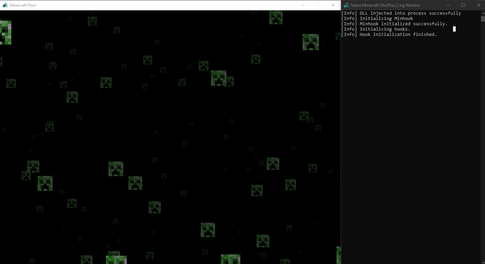

# Minecraft PlusPlus

## What is it?

Minecraft PlusPlus is a DLL mod for [Minecraft Plus](https://plus.minecraft.net).

In order to utilize it, you'l need to do two things:

- rename your downloaded `.src` file to a `.exe`, to allow running as a normal executable.

- find a DLL Injector. I used [Fate Client's Injector](https://github.com/fligger/FateInjector) with a custom target for testing.

## Building

- Make sure to compile for x64 in release mode

- you will  need to rename one of the many downloaded MinHook lib files to get the DLL to compile. I used `libMinHook-x64-v141`.

## License?

Minecraft PlusPlus is licensed under MIT.

## Why?

This serves as a fun excersise with working with hooks.

Also, who doesn't want to be able to say they modded a screensaver?
